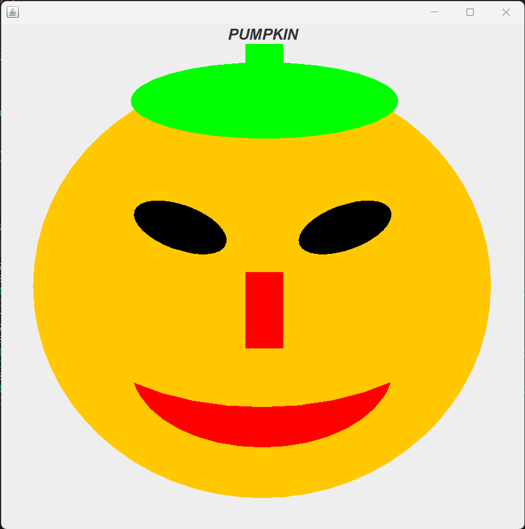

# Pumpkin Drawing Java Application

This Java application allows users to draw a pumpkin on a graphical user interface using Java Swing. It utilizes a custom JPanel for drawing the pumpkin and includes features such as rotating eyes, a carved mouth, and various colored elements.

## Features

1. **Pumpkin Drawing:** Draw a stylized pumpkin on a graphical canvas.

2. **Rotating Eyes:** The pumpkin's eyes dynamically rotate, adding a playful touch to the drawing.

3. **Carved Mouth:** The mouth of the pumpkin is carved, providing a classic jack-o'-lantern appearance.

4. **Colorful Elements:** The drawing incorporates vibrant colors, enhancing the visual appeal of the pumpkin.

## How to Use

To use the Pumpkin Drawing Java Application:

1. **Compile and Run:**
    - Ensure you have Java installed on your system.
    - Compile the `JOLPanel.java` and `DrawPumpkin.java` files.
    - Run the compiled `JOLPanel` class.

2. **Drawing:**
    - Upon launching the application, a window will appear with the pumpkin drawing.
    - Observe the rotating eyes, carved mouth, and vibrant colors.

3. **Customization (Optional):**
    - The code can be modified to explore different drawing elements, colors, or additional features.
    - Adjust the code in `DrawPumpkin.java` to experiment with the pumpkin's appearance.

## Additional Information

This Java application was created using the following technologies:

- **Java Swing:** The graphical user interface framework for creating the drawing canvas and components.

- **Graphics2D and Shape API:** Utilized for drawing shapes and applying transformations to create the rotating eyes.

- **SwingUtilities:** Ensures proper threading for Swing components.

- **Custom JPanel:** The `JOLPanel` class extends JPanel, providing a canvas for drawing the pumpkin, while the `DrawPumpkin` class handles the actual drawing logic.

## Author
Roman Ahmadi